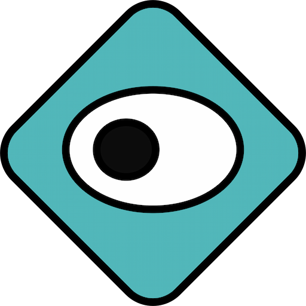
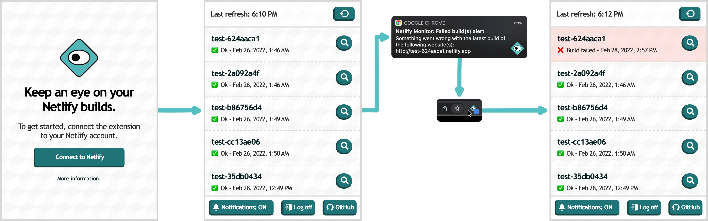
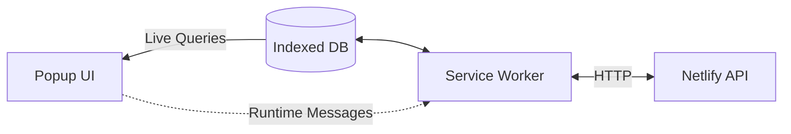

# Netlify Monitor
**A Chrome Extension to keep an eye on your Netlify builds.**

Get notified when a build goes awry, quickly access your Netlify websites and builds directly from Chrome's toolbar.

💾 Check it out on the [Chrome Web Store](https://chrome.google.com/webstore/detail/jichjfbdggldgikccpmchfbgibiaajdl).



**This open-source project is not affiliated with Netlify.**

**Current version:** 0.0.2

[](https://github.com/matteocargnelutti/netlify-monitor/actions/workflows/run-tests.yml)

---

## Summary
- [Videos](#videos)
- [Development Guide](#development-guide)
  - [Architecture](#architecture)
  - [Technology Stack](#technology-stack)
  - [Requirements](#requirements)
  - [Getting Started](#getting-started)
  - [Popup UI Development Environment](#popup-ui-development-environment)
  - [Folders Structure](#folders-structure)
  - [Commands](#commands)
  - [Environment variables](#environment-variables)
  - [Testing](#testing)
  - [Contributing](#contributing)
- [License and Privacy Statement](#license-and-privacy-statement)

---

## Videos

<details>
  <summary><strong>Connect your Netlify account to the extension</strong> 📽️</summary>

  https://user-images.githubusercontent.com/625889/156425536-a43a96ab-ccb5-4fcd-bdda-65f6ef9145fa.mov
</details>

<details>
  <summary><strong>Notification and visual alert for failed builds</strong> 📽️</summary>

  https://user-images.githubusercontent.com/625889/156425522-e64030bb-b92a-4d10-abe7-a07168771ba1.mov
</details>

<details>
  <summary><strong>Quick access to the latest build logs</strong> 📽️</summary>

  https://user-images.githubusercontent.com/625889/156425556-9ab124ab-5eaa-4913-8d2a-79a08174b235.mov
</details>

[☝️ Back to summary](#summary)

---

## Development guide

### Architecture
The architecture of this extension is centered around [indexedDB](https://developer.mozilla.org/en-US/docs/Web/API/IndexedDB_API), which is used to store, organize and communicate data across its different parts. 

The extension's UI doesn't directly make edits to the database [but instead sends runtime messages](https://developer.chrome.com/docs/extensions/reference/runtime/#method-sendMessage) caught by the service worker which handles them.



The service worker pulls fresh data from the Netlify API every 2 minutes.

[☝️ Back to summary](#summary)

---

### Technology Stack

- **General:**
  - [Chrome Extension API](https://developer.chrome.com/docs/extensions/reference/) - [V3 Manifest](https://developer.chrome.com/docs/extensions/mv3/intro/).
  - [IndexedDB](https://developer.mozilla.org/en-US/docs/Web/API/IndexedDB_API) managed with [Dexie.js](https://dexie.org/).
  - [JSDoc](https://jsdoc.app/) for type annotation and documentation.
- **Front-end:**
  -  Web Components _("bare" Custom Elements)_
- **Testing and dev environment:**
  - Puppeteer 
  - Jest
  - BrowserSync

[☝️ Back to summary](#summary)

---

### Requirements
**Machine-level requirement:**
- Chrome 93+ for the extension itself.
- [Latest Node.js LTS](https://nodejs.org/en/) for development and testing _(tested with 16.14)_.

[☝️ Back to summary](#summary)

---

### Getting Started
- Run `npm install` to install all the required development dependencies.
- **Run [`npm setup` to prepare the directory for development](#setup).**<br>
  - This step will enquire about which **Netlify Client ID** to use.
  - You may skip this step, [or create a Netlify Client ID on your Netlify dashboard](https://app.netlify.com/user/applications) to allow the app to request access to the **Netlify API** on the user's behalf.
  - The _"return"_ url of the application you created must point out to the extension itself _(see [Chrome's Identity API documentation](https://developer.chrome.com/docs/extensions/reference/identity/#type-WebAuthFlowDetails))_ :
  ```
  https://[LOCAL-EXTENSION-ID].chromiumapp.org/
  ```
  - A **local extension id** can be obtained by going to `chrome://extensions/` and clicking on _"Load unpacked"_ to install the development version of the extension.  Select the `./extension` folder of this repository to do so.
- **Once everything in set up, there are two options:**
  - **You may use Chrome directly to develop, inspect and troubleshoot the extension**.<br>
  The main advantage of this method is that the <strong>service worker</strong> is running and the extension will behave exactly as it would in production.<br>
  The main downside is that things are more difficult to mock, and a valid **Netlify Client ID** is required.
  - **You may otherwise use the [Popup UI Development Environment](#popup-ui-development-environment)**.<br>
  This method is best suited for development tasks related to the popup UI and offers helpers to inject mocks into the database.<br>
  See [the section dedicated to the popup UI development environment](#popup-ui-development-environment).

[☝️ Back to summary](#summary)

---

### Popup UI Development Environment

A development environment with live reload and mocking helpers is available to help with the development of the Popup UI.

**Get started:**
- **VS Code:** Run `npm run dev-no-open` and press `F5` to start an instance of Chromium connected to **VS Code's debugger**.
- **Any other context:** Run `npm run dev`, which will open a new browser window.

**Important considerations:**
- This environment mocks all of the Chrome Extension API features the Popup UI uses, to a very limited extent.
- None of the features handled by the service worker are available in this context.

<details>
  <summary><strong>Screenshot: Default state</strong> 🖼️</summary>

  
</details>

<details>
  <summary><strong>Screenshot: Database fully mocked</strong> 🖼️</summary>

  
</details>

[☝️ Back to summary](#summary)

---

### Folders Structure
| Name | Description |
| --- | --- |
| `.github/` | GitHub Actions. |
| `.vscode/` | VSCode presets for debugging and recommended extensions. |
| `dev/` | [Popup UI Development Environment](#popup-ui-development-environment). |
| `extension/` | Holds the entire extension codebase.<br>Everything present in this folder will be embedded in the final extension. |
| `misc/` | Design files and various assets. |
| `tests/` | E2E Testing suite. |

[☝️ Back to summary](#summary)

---

### Commands

#### setup
```bash
npm run setup
```

⚠️ This command *must* be run at least once after pulling the repository.

**Prepares the project for development or release:**
- Makes the latest version of [Dexie.js](https://dexie.org/) available to the extension
- Asks for a [Netlify Client ID](https://app.netlify.com/user/applications), used to request access to the Netlify API on behalf of the user.
- Offers to ZIP the current `extension` folder.

#### dev
```
npm run dev
```

Starts BrowserSync and opens a new browser window pointed at the [Popup UI development environment](#popup-ui-development-environment).

#### dev-no-open
```
npm run dev-no-open
```

Similar to `dev`, but does not automatically open a new browser window.

#### test
```
npm run test
```

Starts the [test suite](#testing). 

[☝️ Back to summary](#summary)

---

### Environment variables

| Name | Context | Required | Description |
| --- | --- | --- | --- |
| `TESTS_NETLIFY_ACCESS_TOKEN` | Test suite | No | If provided, allows the [_"Refresh Request"_ test scenario](https://github.com/matteocargnelutti/netlify-monitor/blob/main/tests/scenarios/refreshRequest.test.js) to run.<br>Must give access to a Netlify account with at least 1 website. |
| `PUPPETEER_EXEC_PATH` | Test suite | No | Used for [running Puppeteer in _"headful"_ mode in GitHub Actions](https://github.com/marketplace/actions/puppeteer-headful).<br>Automatically populated.<br>If set, Chromium will run in `--no-sandbox` mode ⚠️. |


[☝️ Back to summary](#summary)

---

### Testing

**At this stage of the project, testing is focused on an hybrid E2E approach using Puppeteer, split into different scenarios.**
- See [the list of available testing scenarios](https://github.com/matteocargnelutti/netlify-monitor/tree/main/tests/scenarios).
- One of the scenarios, _"Refresh request"_, serves as an integration test for parts of the service worker and requires a valid Netlify Access Token. This test will be skipped if the [`TESTS_NETLIFY_ACCESS_TOKEN` environment variable is not set](#environment-variables).
- Puppeteer doesn't support extensions in headless mode and therefore needs to run _"headful"_.

[☝️ Back to summary](#summary)

---

### Contributing
> Work in progress 🚧. 
>
> **In the meantime:** Please feel free to open [issues](https://github.com/matteocargnelutti/netlify-monitor/issues) to report bugs or suggest features.

[☝️ Back to summary](#summary)

---

## License and Privacy Statement

- [This software is distributed under MIT license.](./LICENSE)
- **This extension only stores data locally.**<br>
Data is stored for the sole purpose of supporting the extension's features and can be deleted by the user at any time. No analytics data are collected. 
- This extension uses the official [Netlify API](https://docs.netlify.com/api/get-started/) and [OAuth2 service](https://www.netlify.com/blog/2016/10/10/integrating-with-netlify-oauth2). 
- This open-source project is not affiliated with Netlify.

[☝️ Back to summary](#summary)
